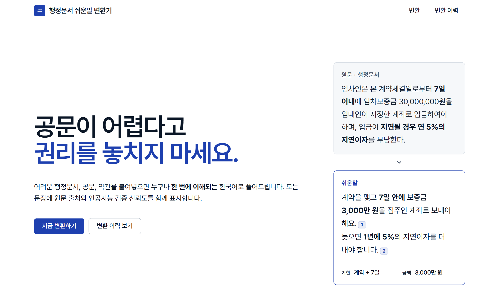

# [Spring 2026] Algorithms — Term Project: Team CLI


This repository hosts **Team CLI**'s term-project for the Spring 2026 Algorithms course at Korea University Sejong, a web app powered by **Upstage Solar Pro 3** that rewrites administrative documents into plain Korean, intentionally applying CLRS algorithm concepts from the course.


<br>

<p align="center">
  
  <br><sub><em>Live demo — <a href="https://cli-al.vercel.app">cli-al.vercel.app</a></em></sub>
</p>

<br><br>

## 📑 Table of Contents

- [About This Repository](#about-this-repository)
- [Course Information](#course-information)
- [Team](#team)
- [Project Overview](#project-overview)
- [Architecture](#architecture)
  - [Frontend](#frontend) · [Backend](#backend) · [LLM & Prompt Engineering](#llm--prompt-engineering)
- [Setup & Run](#setup--run)
- [Deliverables](#deliverables)
- [License](#license)

---


<br><a name="about-this-repository"></a>
## 📝 About This Repository

This repository holds the source code, documentation, and final deliverables of Team CLI's term-project for the Spring 2026 Algorithms course. The project is **complete** — the application is deployed (Vercel + Render) and was presented in the final class session.

> **🤖 AI-Assisted Development**
> This course encourages the use of AI agents. A team [Claude Code](https://claude.ai/download) license provided by the course was used throughout for coding, refactoring, debugging, testing, and documentation.

<br><a name="course-information"></a>
## 📚 Course Information

- **Semester:** Spring 2026 (March – June)
- **Affiliation:** Korea University Sejong

| Course&nbsp;Code | Course | Type | Instructor | Department |
|:----------:|:------------------|:-------------:|:---------------:|:----------------------------------------|
|`DCSS309-00`|ALGORITHM|Major Required|Prof. Unggi&nbsp;Lee|Department of Computer Science and Software Engineering|

- **📖 References**

| Type | Contents |
|:----:|:---------|
|Textbook|"Introduction to Algorithms, 3rd Edition" — Cormen, Leiserson, Rivest, Stein (CLRS)|
|Lecture Notes|[Instructor's notes & slides (GitHub)](https://github.com/codingchild2424/2026-lecture-algorithm)|
|LLM API|[Upstage Solar — AI Initiative 2025](https://www.upstage.ai/events/ai-initiative-2025-ko)|

<br><a name="team"></a>
## 👥 Team

**Team CLI** — roles map directly to the three architecture layers below.

| Role | Name |
|:-----|:-----|
| Project Manager | Park Cheolwon |
| Frontend | Song Minseong |
| Backend | Kang Seonguk |
| LLM / Prompt Engineering | Kwak Jun |

<br><a name="project-overview"></a>
## 🎯 Project Overview

Paste or upload an administrative document (lease clause, public notice, government form, contract, …) and the service returns a plain-Korean rewrite with citation markers, a glossary of difficult terms, key-info cards (obligations · rights · deadlines), and an action checklist.

**Core features**

1. **Plain-Korean rewriting** with `[1]` `[2]` citation markers tying each claim back to the source span.
2. **Structured extraction** — glossary, key-info cards, and action checklist generated alongside the rewrite.
3. **Groundedness check** — every response is scored by Upstage's Groundedness API and surfaced as a coloured badge.

**Demo** — Live: [cli-al.vercel.app](https://cli-al.vercel.app) · API health: [`/health`](https://cli-al-backend.onrender.com/health)

<br><a name="architecture"></a>
## 🏗 Architecture

A **Frontend + Backend** web app with an LLM rewrite pipeline. The three layers below mirror the team roles.

| Layer | Stack | Hosting |
|:------|:------|:--------|
| Frontend | Next.js 15 (App Router, React 19) + Tailwind CSS | Vercel |
| Backend | FastAPI + uvicorn (Python 3.11) · Supabase (Postgres) | Render (Singapore) |
| LLM / RAG | Upstage Solar Pro 3 · Document Parse · Groundedness · hybrid RAG | — |

<details>
<summary>📂 Repository structure</summary>

```
CLI_AL/
├── backend/             FastAPI app (entry: app.main:app)
│   ├── app/
│   │   ├── routers/     /health · /parse · /rewrite · /history
│   │   ├── services/    upstage_client · rewrite_service · algorithms · prompt_loader · rate_limit
│   │   └── rag/          Hybrid RAG (store · indexer · retriever · db)
│   ├── scripts/         build_rag_seed.py
│   └── tests/           pytest (test_health · test_prompt_loader)
├── frontend/            Next.js (App Router, React 19)
│   ├── app/             landing · convert · history pages
│   ├── components/      Dropzone · RewriteText · KeyInfoCards · Checklist · ResultActions · …
│   └── lib/             api.ts · useScrollSnap.ts · Bionic.tsx
├── llm/
│   ├── prompts/         relevance_check_v1 · rewrite_v2 · analysis_v1
│   └── corpus/          rag_seed.jsonl (322 법제처 정비 사례)
├── supabase/migrations/ 0001_init.sql
├── infra/               Makefile + dev.ps1 (local two-server bring-up)
└── docs/                SETUP.md · DEPLOY.md
```
</details>

<br><a name="frontend"></a>
### 🖥 Frontend

Next.js 15 (App Router, React 19) + Tailwind, deployed on Vercel.

- **Snap sections + citation sync** — full-viewport GSAP scroll-snap with intra-panel scroll lock; scrolling the rewrite highlights the matching `[N]` citation chip.
- **Accessibility panel** — 3-step font size, dark mode, dyslexia assist (OpenDyslexic + site-wide Bionic Reading).
- **Result export** — clean plain-text copy (Korean labels) and a dedicated print document (`@media print`).
- **History restore** — `/convert?id=<rewrite_id>` re-hydrates a saved result without re-calling the LLM.
- **Guards** — irrelevant-input notice (non-administrative text is not saved) and a first-visit legal disclaimer.

<br><a name="backend"></a>
### ⚙️ Backend

FastAPI + uvicorn (Python 3.11), Supabase (Postgres) for persistence, deployed on Render.

**Algorithm concepts (CLRS)** — implemented in [`algorithms.py`](backend/app/services/algorithms.py) (called from [`rewrite_service.py`](backend/app/services/rewrite_service.py)) and [`rag/retriever.py`](backend/app/rag/retriever.py), as part of the `/rewrite` pipeline.

| Concept | CLRS | Where | Complexity | Note |
|:--------|:----:|:------|:----------:|:-----|
| Hash Table (Chaining) | 11.2 | `dedup_glossary` | O(1) avg | Rolling hash; drops duplicate glossary terms. |
| Merge Sort | 2.3 | `merge_sort_glossary` | Θ(n log n) | Stable alphabetical glossary sort. |
| Counting Sort | 8.2 | `counting_sort_checklist` | Θ(n+k), k=3 | Checklist by priority (high→low), linear. |
| DP — LCS | 15.4 | `lcs_word_ratio` | O(mn) / O(n) space | Word-LCS original↔rewrite → `preservation_ratio`. |
| Graph — BFS | 22.1–22.2 | `bfs_related_terms` | O(V+E) | Term-dependency graph → transitively related terms. |
| Randomized Selection | 9.2 | `top_n_by_score` | O(n) expected | QuickSelect top-N RAG chunks, no full sort. |
| LSD Radix Sort | 8.3 | `radix_sort_by_score_desc` | Θ(d·(n+b)) | Stable ranking of RAG candidates by score. |

**API** (base: `https://cli-al-backend.onrender.com`)

| Method | Path | Purpose |
|:------:|:-----|:--------|
| GET | `/health` | Health probe (`status`, `*_configured`, `model`). |
| POST | `/parse` | File → text (PDF · TXT · DOCX · HWPX, ≤10 MB). |
| POST | `/rewrite` | Main entry → rewrite + citations + glossary + key-info + checklist + groundedness. Rate-limited 10/min. |
| GET | `/history?limit=N` | Recent rewrites (max 100). |
| GET · DELETE | `/history/{id}` | Restore / delete a single rewrite (delete cascades). |

**Database** (Supabase / Postgres, [`0001_init.sql`](supabase/migrations/0001_init.sql)) — `documents` (input texts) and `rewrites` (structured results, FK `ON DELETE CASCADE`). RLS on; anonymous reads allowed, writes via backend `service_role`. Irrelevant inputs are never persisted.

<br><a name="llm--prompt-engineering"></a>
### 🤖 LLM & Prompt Engineering

Upstage **Solar Pro 3**. `POST /rewrite` runs four Solar calls in series, then post-processes with the CLRS algorithms.

1. **Relevance check** ([`relevance_check_v1`](llm/prompts/relevance_check_v1.md)) — is the input an administrative document? If not, short-circuit with guidance and skip history.
2. **Rewrite + citations** ([`rewrite_v2`](llm/prompts/rewrite_v2.md)) — hybrid RAG (lexical + semantic) over [`rag_seed.jsonl`](llm/corpus/rag_seed.jsonl) (법제처 정비 사례) injects up to 3 supporting chunks; the model emits the rewrite with `[N]` markers.
3. **Structured extraction** ([`analysis_v1`](llm/prompts/analysis_v1.md)) — glossary, key-info cards, and checklist as one JSON response.
4. **Summary** — a short `chat_text` call condensing the rewrite (~30 chars) for the history preview.

After the calls: Upstage **Groundedness Check** scores the rewrite (coloured badge), and DP-LCS yields a deterministic `preservation_ratio`. Prompts are versioned under [`llm/prompts/`](llm/prompts/).

<br><a name="setup--run"></a>
## 🚀 Setup & Run

> Full instructions: [`docs/SETUP.md`](docs/SETUP.md) (local) · [`docs/DEPLOY.md`](docs/DEPLOY.md) (production). Minimal local steps below. Requires **Python 3.11+** and **Node 20+**.

```bash
git clone https://github.com/Choroning/CLI_AL.git && cd CLI_AL

# 1. Apply supabase/migrations/0001_init.sql in the Supabase SQL Editor
# 2. Configure env files
cp backend/.env.example  backend/.env          # UPSTAGE_API_KEY, SUPABASE_URL, SUPABASE_SECRET_KEY, CORS_ALLOW_ORIGINS
cp frontend/.env.example frontend/.env.local   # NEXT_PUBLIC_API_BASE_URL (+ optional NEXT_PUBLIC_SUPABASE_*)

# 3. Install & run both servers
cd infra && make install && make -j2 dev       # macOS/Linux — backend :8000 · frontend :3000
#   Windows:  pwsh ./infra/dev.ps1 install; pwsh ./infra/dev.ps1
```

Verify: `http://localhost:3000` (landing) and `http://localhost:8000/health` (`{"status":"ok",…}`). Tests — backend `cd backend && pytest -q`; frontend `cd frontend && npm run build` (type-checks). Get free Upstage credits via [AI Initiative 2025](https://www.upstage.ai/events/ai-initiative-2025-ko).

<br><a name="deliverables"></a>
## 📦 Deliverables

| # | Deliverable | Status |
|:-:|:------------|:------:|
| 1 | Application — working product + full source (this repository), deployed to Vercel + Render | ✅ Delivered |
| 2 | Technical Report — architecture, tech stack, LLM usage, key implementation details | ✅ Submitted |
| 3 | Development Process Document — planning, scheduling, execution, retrospective | ✅ Submitted |
| 4 | Presentation Slides (in English) | ✅ Presented |

> The final presentation was delivered **in English** during class.

<br><a name="license"></a>
## 🤝 License

This repository is released under the [MIT License](LICENSE).

---
